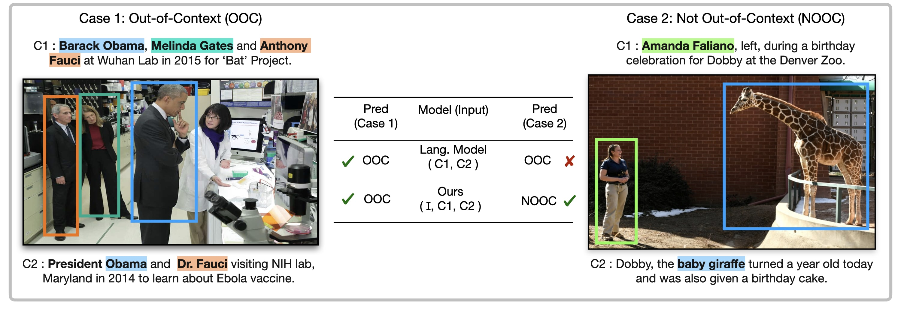

## COSMOS Dataset

[COSMOS dataset](https://shivangi-aneja.github.io/projects/cosmos/) consists of images and captions scraped from news articles and other websites designed for training and evaluation of out-of-context use of images. We refer readers to the [paper](https://arxiv.org/abs/2101.06278) for more details. To get access to the dataset, please fill out [this form](https://docs.google.com/forms/d/13kJQ2wlv7sxyXoaM1Ddon6Nq7dUJY_oftl-6xzwTGow). We will provide you script to download the dataset.



### Dataset Description

#### Dataset Statistics
COSMOS dataset consist of three splits : Training (160 K images), Validation (40 K images) and Test (1700 images). For training, we do not have/use out-of-context annotations. We only use these annotations in the end to evaluate our model. The dataset stats are listed below.

<p align='center'>Table 1: Dataset stats.</p>
<table align='center' class="docutils">
 
  <tr>
    <td><b>Split</b></td>
    <td><b># Images</b></td>
    <td><b># Captions</b></td>
    <td><b>Context Annotation</b></td>
  </tr>
  <tr>
    <td align='center'>Train</td>
    <td align='center'>161,752</td>
    <td align='center'>360,749</td>
    <td align='center'> No </td>
  </tr>
  <tr>
    <td align='center'>Valid</td>
    <td align='center'>41,006</td>
    <td align='center'>90,036</td>
    <td align='center'>No</td>

  </tr>
  <tr bgcolor="#808080">
    <td align='center'>Test </td>
    <td align='center'>1700</td>
    <td align='center'>3400</td>
    <td align='center'>Yes</td>
  </tr>
</table>

</br>

#### Data Format

The COSMOS training, validation and test sets are provided as JSON (JavaScript Object Notation) text files with the following attributes for every data sample stored as a dictionary:

**File Structure for train.json and val.json**
```
{	"img_local_path": <img_path>, 
	"articles": [
                 { "caption": <caption1>, 
                   "article_url": <url1>, 
                   "caption_modified": <caption_mod1>,
                   "entity_list": <entity_list1>},
                   
                 { "caption": <caption2>,
                   "article_url": <url2>,
                   "caption_modified": <caption_mod2>,
                   "entity_list": <entity_list2>},

                 { "caption": <caption3>,
                   "article_url": <url3>,
                   "caption_modified": <caption_mod3>,
                   "entity_list": <entity_list3>},
                   
                  ......

				 ],
    "maskrcnn_bboxes": [ [x1,y1,x2,y2], [x1,y1,x2,y2], ... ]
}
```
**Attributes in Train/Validation files**

 `img_local_path`:     Source path in dataset directory for the image         
`articles`:          List of dict containing metadata for every caption associated with the image                  
 `caption`:           Original Caption scraped from the news website                          
 `article_url`:        Link to the website image and caption scraped from                           
 `caption_modified`:   Modified caption after applying Spacy NER (We used these caption as input to our model during experiments)                           
 `entity_list`:        List that consists of mapping between modified named entities in the caption with the corresponding hypernym                          
 `maskrcnn_bboxes`:           List of detected bounding boxes corresponding to the image. (x1,y1) refers to start vertex of the rectangle and (x2, y2) refers to end vertex of the rectangle                

</br>

Note that for detecting bounding boxes, we used [Detectron2 pretrained model](https://github.com/facebookresearch/detectron2/blob/master/MODEL_ZOO.md) linked [here](https://github.com/facebookresearch/detectron2/blob/master/configs/COCO-Keypoints/keypoint_rcnn_X_101_32x8d_FPN_3x.yaml). We detect upto 10 bounding boxes per image.


</br>

**File Structure for test.json**
```
{	
        "img_local_path": <img_path>,
	"caption1": <caption1>,
	"caption1_modified": <caption1_modified>,
	"caption1_entities": <caption1_entities>,
	"caption2": <caption2>,
	"caption2_modified": <caption2_modified>,
	"caption2_entities": <caption2_entities>,
	"article_url": <article_url>,
	"label": "ooc/not-ooc",
	"maskrcnn_bboxes": [ [x1,y1,x2,y2], [x1,y1,x2,y2], ... ]
}
```
**Attributes in Test file**

 `img_local_path`: Source path in dataset directory for the image   
 `caption1`: First caption associated with the image   
 `caption1_modified`: Modified Caption1  after applying Spacy NER  
 `caption1_entities`: List that consists of mapping between modified named entities in the caption1 with the corresponding hypernym  
 `caption2`: Second caption associated with the image   
 `caption2_modified`: Modified Caption2  after applying Spacy NER  
 `caption2_entities`: List that consists of mapping between modified named entities in the caption2 with the corresponding hypernym  
 `article_url`: Link to the website image and caption scraped from   
 `label`: Class label whether the two captions are out-of-context with respect to the image (1=Out-of-Context, 0=Not-Out-of-Context )  
 `maskrcnn_bboxes`: List of detected bounding boxes corresponding to the image. (x1,y1) refers to start vertex of the rectangle and (x2, y2) refers to end vertex of the rectangle  

### Citation

**If you find our dataset or paper useful for your research , please include the following citation:**

```
@misc{aneja2021cosmos,
      title={COSMOS: Catching Out-of-Context Misinformation with Self-Supervised Learning}, 
      author={Shivangi Aneja and Chris Bregler and Matthias Nießner},
      year={2021},
      eprint={2101.06278},
      archivePrefix={arXiv},
      primaryClass={cs.CV}
}
```

</br>

### Contact Us

If you have questions regarding the dataset or code, please email us at shivangi.aneja@tum.de. We will get back to you as soon as possible.